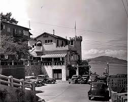
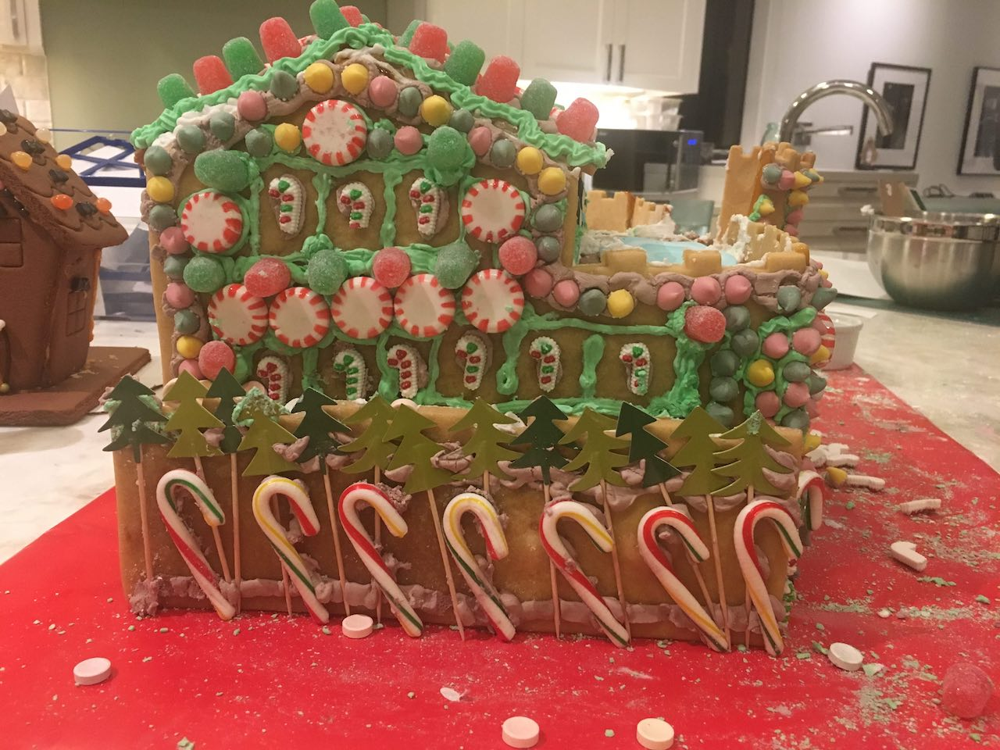
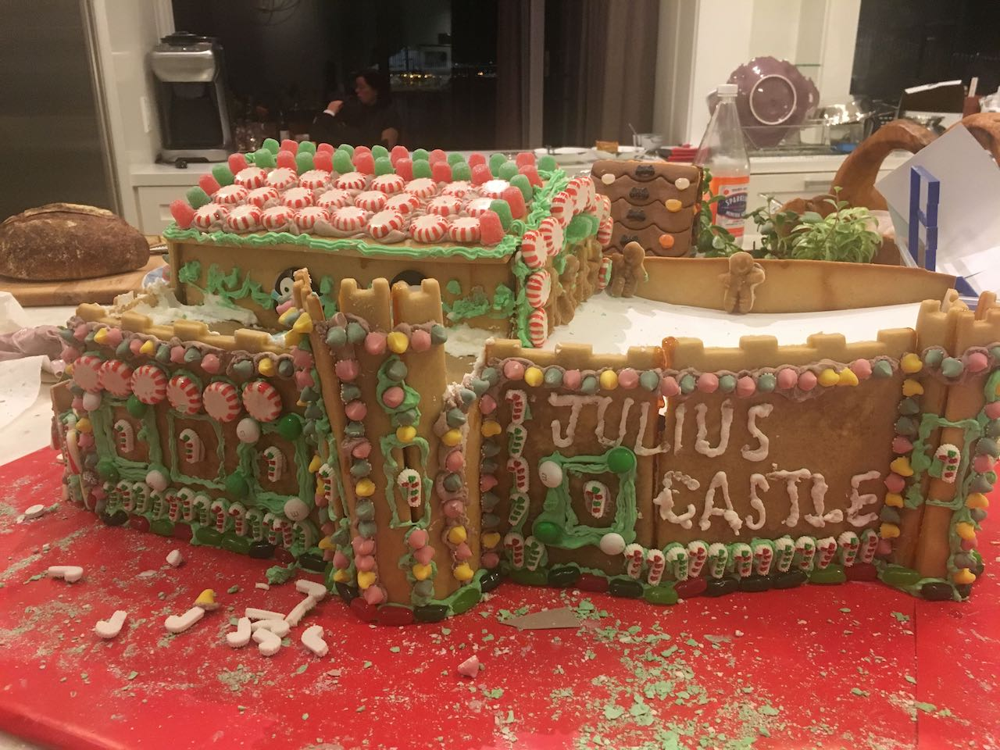
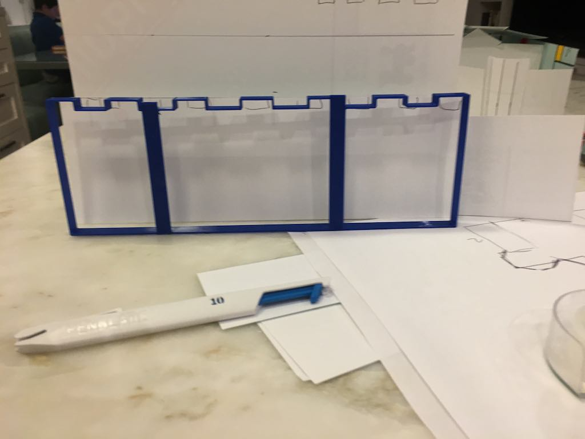
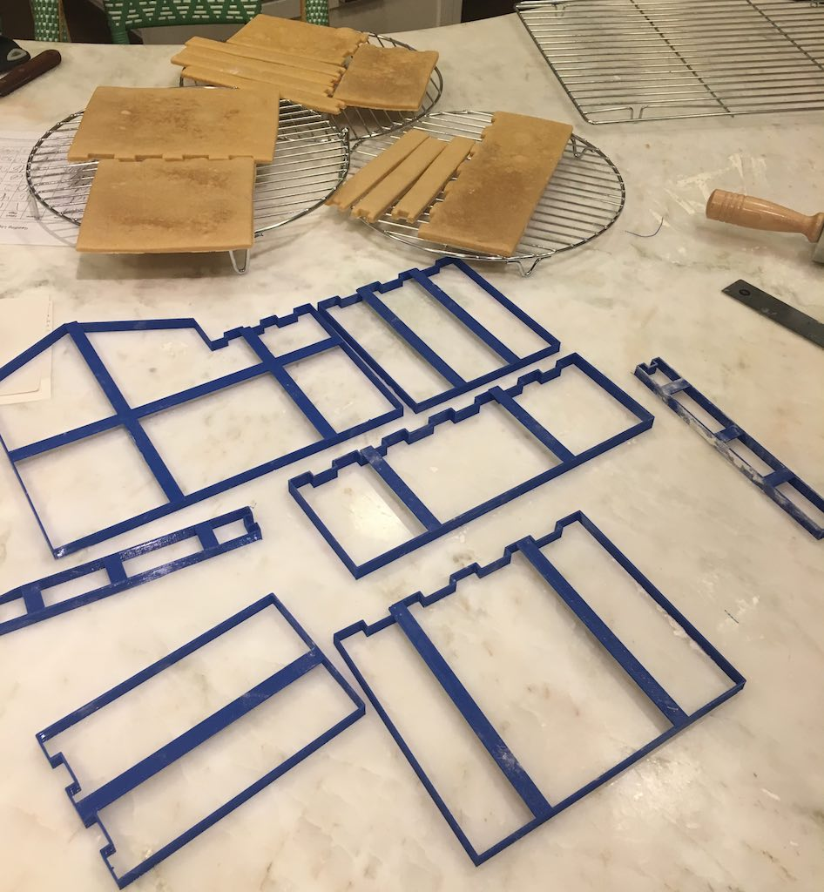
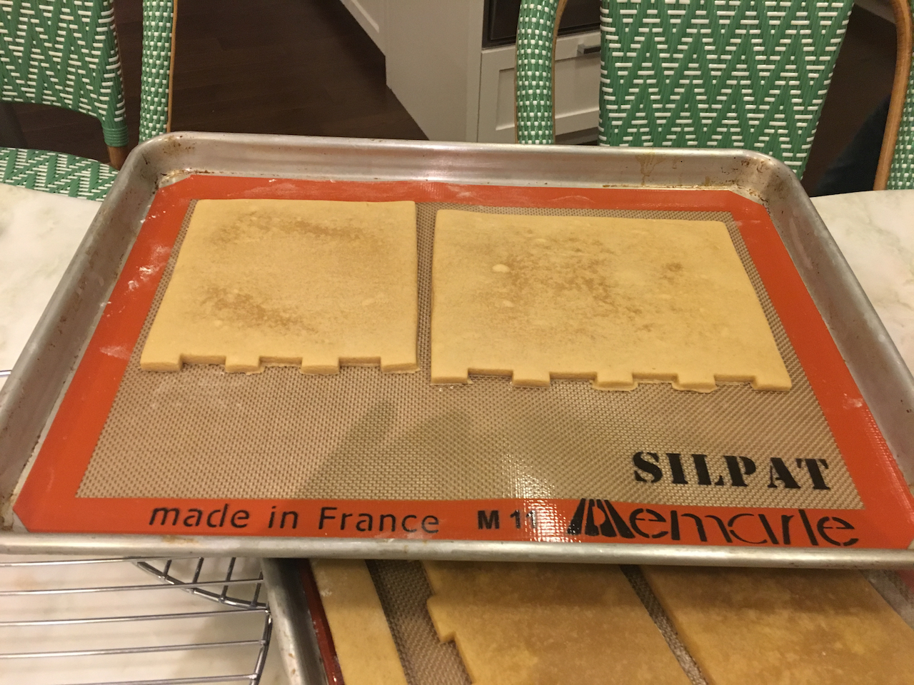
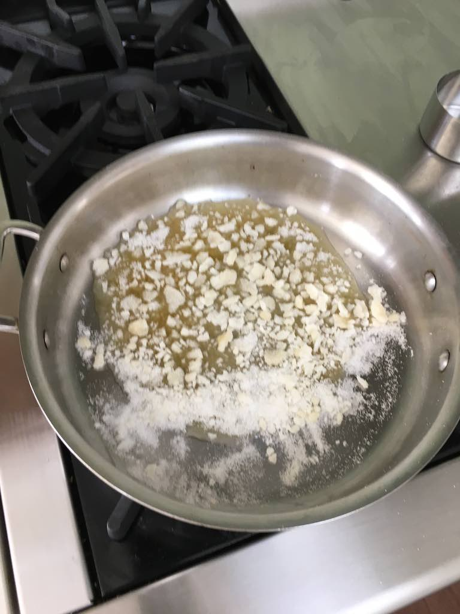
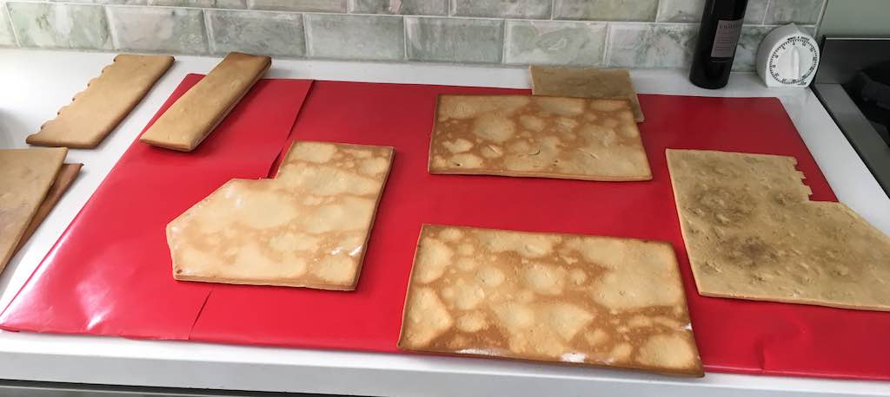
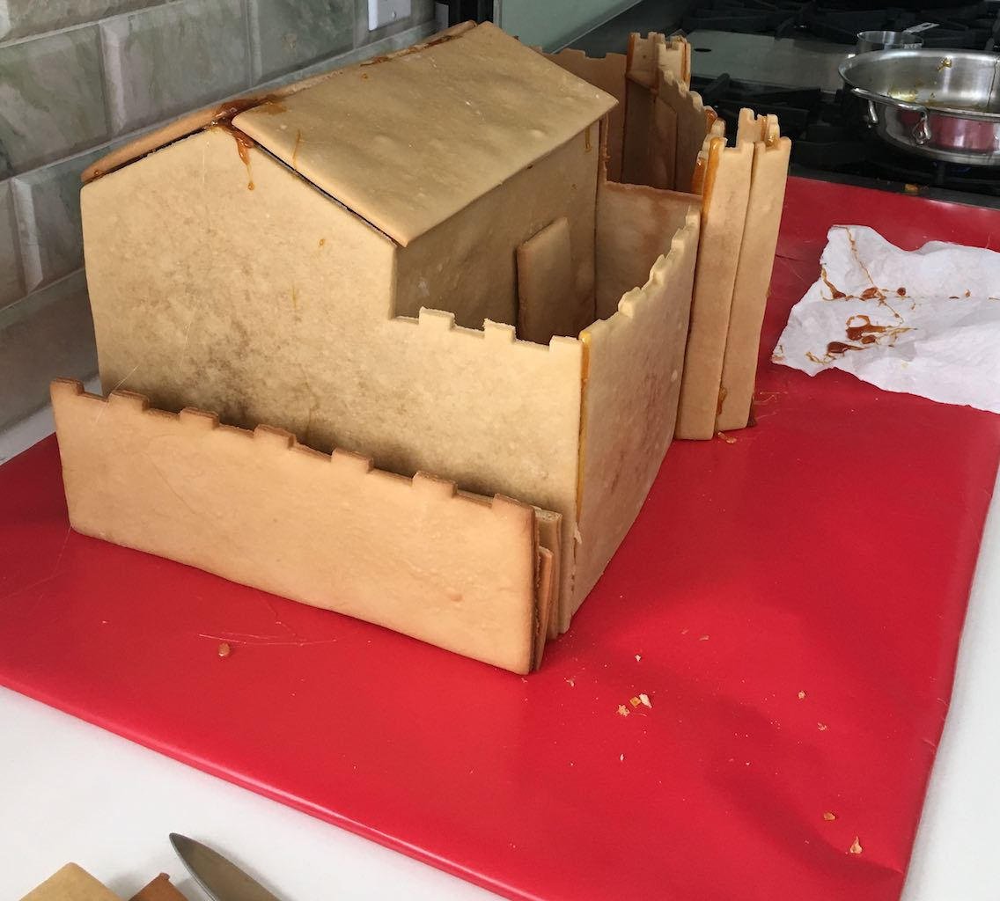
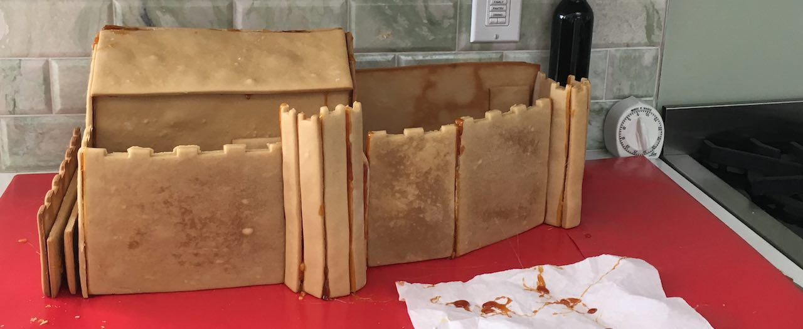

#Julius Castle

This is an attempt to build cookie cutters to cut gingerbread and assemble a simplified version of Julius Castle on telegraph hill in San Francisco.

## Design Overview

The design was started by looking at the building, photos, and a google map view.  It was translated into a rough outline of the footprint of the building as well as each of the sides.  I figured the building was probably around 40ft tall, and started from there to proportion out the building in paper. My first model was way too small, so I enlarged it.

I was limited by 11" on the largest side because of the size of my 3D printer.

## Cookie Cutters

I found some code to convert inkscape drawings into cookie cutters: 
[inkscape to openscad](https://cubehero.com/2013/12/31/creating-cookie-cutters-using-offsets-in-openscad/)

## Workflow

I used Adobe Illustrator to create paths of each wall. Then I opened them in inkscape, and exported DXF files. These DXF files are loaded one at a time in the juliuscastle.scad file, and are saved as STL files.  The STL files should print out cookie cutters. They might be upside down, check before printing.

## Assembly

I used this [structural gingerbread recipe](https://www.thespruce.com/gingerbread-house-dough-recipe-1136139) and baked the pieces I made cutters for. The square pieces I cut using cardstock templates.

I melted 1 cup of sugar in the pan, and used it to "superglue" the gingerbread together. Be careful not to burn yourself, it is really hot. I wear gloves that I can take off quickly if the sugar gets on my hands.

